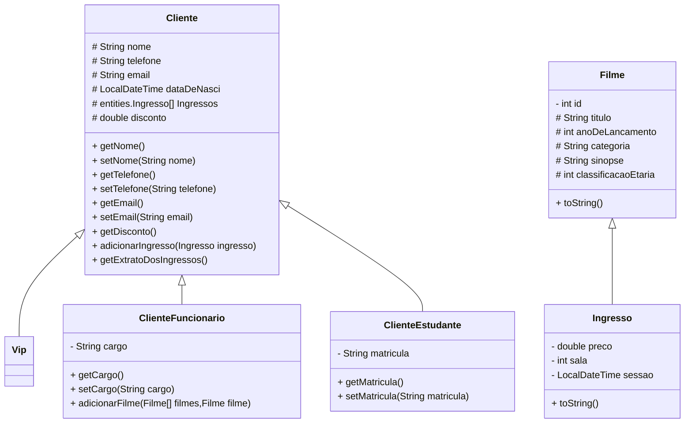

## Diagrama

```mermaid
classDiagram
Cliente : # String nome
Cliente : # String telefone
Cliente : # String email
Cliente : # LocalDateTime dataDeNasci
Cliente : # entities.Ingresso[] Ingressos
Cliente : # double disconto
Cliente : + getNome()
Cliente : + setNome(String nome)
Cliente : + getTelefone()
Cliente : + setTelefone(String telefone)
Cliente : + getEmail()
Cliente : + setEmail(String email)
Cliente : + getDisconto()
Cliente : + adicionarIngresso(Ingresso ingresso)
Cliente : + getExtratoDosIngressos()

ClienteEstudante : - String matricula
ClienteEstudante : + getMatricula()
ClienteEstudante : + setMatricula(String matricula)

ClienteFuncionario : - String cargo
ClienteFuncionario : + getCargo()
ClienteFuncionario : + setCargo(String cargo)

ClienteFuncionario : + adicionarFilme(Filme[] filmes,Filme filme)

Cliente <|-- Vip
Cliente <|-- ClienteFuncionario
Cliente <|-- ClienteEstudante

Filme : - int id
Filme : # String titulo
Filme : # int anoDeLancamento
Filme : # String categoria
Filme : # String sinopse
Filme : # int classificacaoEtaria
Filme : + toString()

Ingresso: - double preco
Ingresso: - int sala
Ingresso: - LocalDateTime sessao
Ingresso : + toString()

Filme <|-- Ingresso
```
