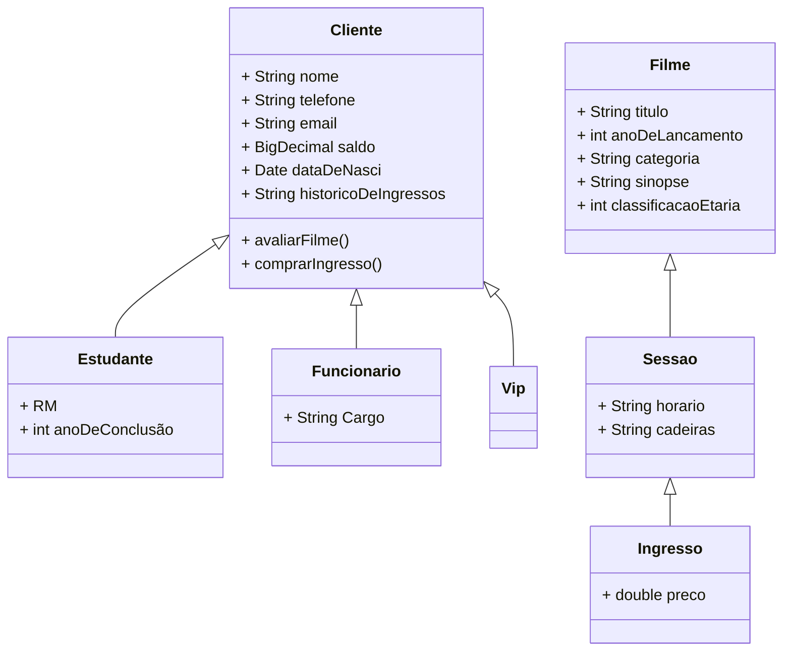

## Diagrama

```mermaid
classDiagram
Cliente : + String nome
Cliente : + String telefone
Cliente : + String email
Cliente : + BigDecimal saldo
Cliente : + Date dataDeNasci
Cliente : + String historicoDeIngressos
Cliente : + avaliarFilme()
Cliente : + comprarIngresso()

Estudante : + RM
Estudante : + int anoDeConclusão

Funcionario : + String Cargo

Cliente <|-- Vip
Cliente <|-- Funcionario
Cliente <|-- Estudante

Filme : + String titulo
Filme : + int anoDeLancamento
Filme : + String categoria
Filme : + String sinopse
Filme : + int classificacaoEtaria

Ingresso: + double preco

Sessao : + String horario
Sessao : + String cadeiras

Filme <|-- Sessao
Sessao <|-- Ingresso
```
