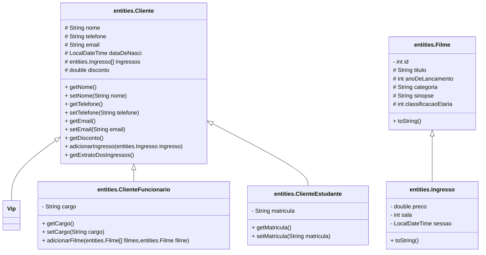

## Diagrama

```mermaid
classDiagram
entities.Cliente : # String nome
entities.Cliente : # String telefone
entities.Cliente : # String email
entities.Cliente : # LocalDateTime dataDeNasci
entities.Cliente : # entities.Ingresso[] Ingressos
entities.Cliente : # double disconto
entities.Cliente : + getNome()
entities.Cliente : + setNome(String nome)
entities.Cliente : + getTelefone()
entities.Cliente : + setTelefone(String telefone)
entities.Cliente : + getEmail()
entities.Cliente : + setEmail(String email)
entities.Cliente : + getDisconto()
entities.Cliente : + adicionarIngresso(entities.Ingresso ingresso)
entities.Cliente : + getExtratoDosIngressos()

entities.ClienteEstudante : - String matricula
entities.ClienteEstudante : + getMatricula()
entities.ClienteEstudante : + setMatricula(String matricula)

entities.ClienteFuncionario : - String cargo
entities.ClienteFuncionario : + getCargo()
entities.ClienteFuncionario : + setCargo(String cargo)
entities.ClienteFuncionario : + adicionarFilme(entities.Filme[] filmes,entities.Filme filme)

entities.Cliente <|-- Vip
entities.Cliente <|-- entities.ClienteFuncionario
entities.Cliente <|-- entities.ClienteEstudante

entities.Filme : - int id
entities.Filme : # String titulo
entities.Filme : # int anoDeLancamento
entities.Filme : # String categoria
entities.Filme : # String sinopse
entities.Filme : # int classificacaoEtaria
entities.Filme : + toString()


entities.Ingresso: - double preco
entities.Ingresso: - int sala
entities.Ingresso: - LocalDateTime sessao
entities.Ingresso : + toString()


entities.Filme <|-- entities.Ingresso
```
