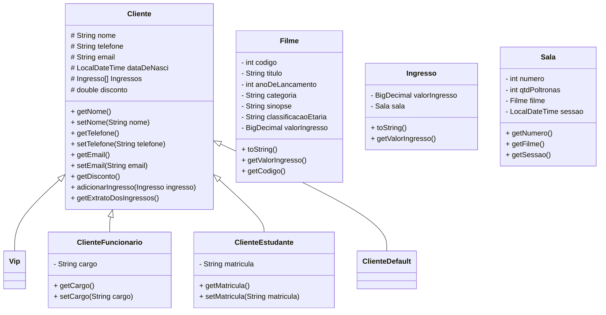

# Terminal de Autoatendimento para Compra de Ingressos

Este projeto consiste em uma aplicação de terminal de autoatendimento para compra de ingressos de cinema, desenvolvida em Java utilizando o IntelliJ IDEA. A aplicação permite o cadastro de clientes, além da compra e gerenciamento de ingressos de filmes associados a cada cliente. A aplicação foi desenhada para ser utilizada em terminais de autoatendimento em cinemas.
## Diagrama


## Funcionalidades

- **Registrar Cliente**: Permite o registro de novos clientes, solicitando nome, telefone e e-mail.
- **Login de Cliente**: O cliente pode fazer login utilizando seu número de telefone.
- **Comprar Ingresso**: Após o login, o cliente pode selecionar um filme disponível e comprar ingressos.
- **Ver Histórico de Ingressos**: Clientes podem visualizar o histórico de ingressos comprados.
- **Deslogar Cliente**: Permite ao cliente encerrar sua sessão.
- **Manutenção de Usuários (Acesso Restrito a Funcionários)**: Funcionários podem acessar funcionalidades administrativas, como adicionar, editar ou remover usuários do sistema.

## Requisitos Funcionais

- O usuário deve ser capaz de adicionar e gerenciar ingressos de filmes associados ao cliente cadastrado.
- O cliente pode realizar operações com o ingresso, como alterar o horário da sessão ou cancelar a compra.
- Todos os dados (clientes e ingressos) devem ser exibidos na tela de forma clara e organizada.

## Requisitos Não Funcionais

- Foi implementada uma classe `Cliente`, que contém os atributos essenciais do cliente.
- Os atributos das classes são privados, respeitando o princípio de encapsulamento, com acesso controlado via getters e setters.
- Tratamento de erros foi implementado para garantir que o usuário receba mensagens claras quando ocorrerem problemas, como tentar cadastrar um cliente com telefone já existente ou tentar alterar um ingresso que não existe.
- A classe `Ingresso` herda de uma classe `Item`, onde métodos foram sobrescritos, e novos atributos foram adicionados, como a opção de horário da sessão e o tipo de ingresso.

## Estrutura do Projeto

A aplicação foi organizada da seguinte forma:

- `src/`: Contém os arquivos de código-fonte em Java.
    - `Main.java`: Ponto de entrada da aplicação.
    - `MenuUtils.java`:Utilitário que organiza a exibição do menu com base no estado atual (cliente logado, funcionário logado, etc.)
    - `Cliente.java`: Classe que representa os clientes cadastrados.
    - `ClienteFuncionario.java`: Subclasse de Cliente, que representa funcionários e permite acesso à manutenção de usuários.
    - `Ingresso.java`: Classe que representa o ingresso comprado pelo cliente.
    - `Sala.java`: Classe que modela a sala onde o filme será exibido.
    - `ClienteUtils.java`: Utilitário para adicionar, editar, remover e listar clientes.
    - `FilmeUtils.java`:Utilitário que contém a lógica de gerenciamento dos filmes disponíveis.
- `README.md`: Arquivo de documentação do projeto.

## Fluxo de Uso
1. **Menu Principal**: Ao iniciar a aplicação, o usuário é apresentado a um menu com as opções de registrar-se, fazer login, ou sair.
2. **Comprar Ingresso**: Após logar, o cliente pode visualizar a lista de filmes disponíveis e selecionar o filme para compra de ingresso.
3. **Histórico**: O cliente logado pode visualizar um histórico de todos os ingressos comprados anteriormente.
4. **Administração**: Caso o cliente logado seja um funcionário, ele pode acessar o menu de manutenção de usuários.

## Requisitos para Execução

- Java 8 ou superior
- IntelliJ IDEA ou outro IDE para Java
- Git para controle de versão

## Como Executar

1. Clone o repositório:
   ```bash
   git clone https://github.com/EyzRyder/agenda-filme.git
   ```
Abra o projeto no IntelliJ IDEA.
Execute a classe AutoAtendimento.java para iniciar a aplicação.